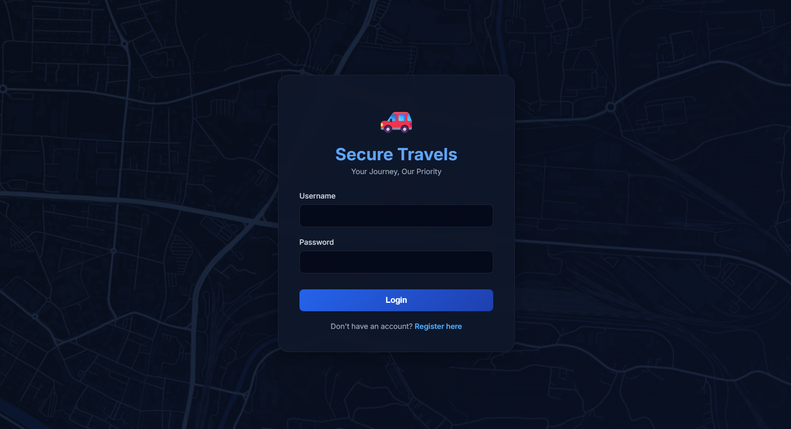
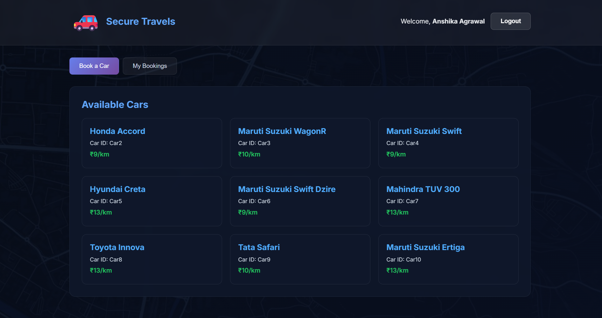

# 🚗 Secure Travels – Car Booking System

Secure Travels is a full-stack car booking web application that allows users to register, log in, browse available cars, book rides, view bookings, and cancel bookings.  
The project is built with a modern dark-themed UI and a Python Flask backend.

---

## ✨ Features

- 🔐 User Authentication (Login & Registration)
- 🚘 Browse Available Cars with Pricing
- 📅 Book a Car with Pickup Date & Time
- 🧾 Booking Receipt with Cost Breakdown
- ❌ Cancel Booking with Confirmation Popup
- 🎨 Professional Dark Blue UI Theme
- 📱 Responsive Design
- ⚡ Smooth Loading & Transition Animations

<p align="center">
  
  
</p>


---

## 🛠 Tech Stack

### Frontend
- HTML5
- CSS3 (Dark UI Theme)
- JavaScript (Fetch API)

### Backend
- Python
- Flask (REST APIs & Sessions)

### Database
- SQLite (Relational Database)

---

## 📂 Project Structure
Secure-Travels/
├── app.py
├── database.py
├── requirements.txt
├── templates/
│ ├── index.html
│ ├── register.html
│ └── dashboard.html
├── static/
│ ├── css/style.css
│ ├── js/script.js
│ └── images/
│ ├── logo.png
│ ├── favicon.png
│ └── login-bg.jpg
└── README.md

---

## 🚀 How to Run the Project

### 1️⃣ Clone the Repository
```bash
git clone https://github.com/your-username/secure-travels.git
cd secure-travels
```

### 2️⃣ Create Virtual Environment
```
python -m venv venv
venv\Scripts\activate
```

### 3️⃣ Install Dependencies
```
pip install -r requirements.txt
```

### 4️⃣ Run the Application
```
python app.py
```

### 5️⃣ Open in Browser
```
http://127.0.0.1:5000
```
---

## 🔮 Future Enhancements
- 💳 Payment Gateway Integration
- 🗺 Google Maps Distance Calculation
- 📊 Admin Dashboard
- ☁ Deployment on AWS / Render

  
